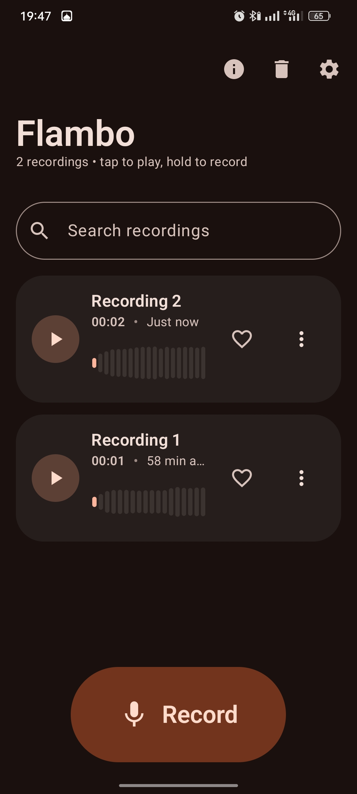
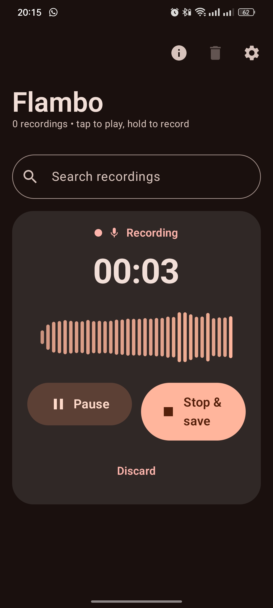
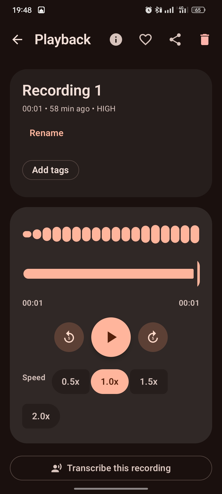
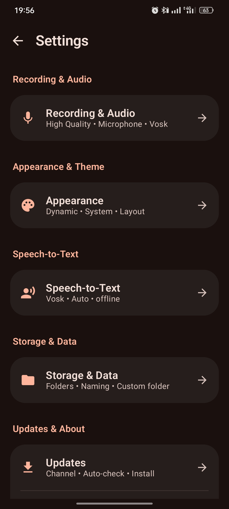

<div align="center">
  
  <h1>Flambo</h1>
  <p><em>A calm yet expressive voice recorder for Android — record, transcribe, and keep everything on your device.</em></p>
  <p>
    <a href="https://m3.material.io/blog/introducing-m3-expressive"></a>
    <a href="https://kotlinlang.org"></a>
    <a href="https://developer.android.com/jetpack/compose"></a>
    
    
    <a href="https://github.com/MoHamed-B-M/flambo/releases"></a>
  </p>
  <p>
    <a href="https://github.com/MoHamed-B-M/flambo/actions/workflows/build.yaml"></a>
    
    
    <a href="https://github.com/MoHamed-B-M/flambo/blob/beta/CONTRIBUTING.md"></a>
  </p>
</div>

## Features

- **One-tap recording** with an animated-shape record button, live waveform, and pause/resume on a continuous timeline
- **Two sources** — microphone, or system sound (music, videos, app audio) via AudioPlaybackCapture on Android 10+
- **Live notification** with running timer plus Pause/Resume and Save actions, so recording survives the screen turning off
- **Offline transcription** — Vosk turns saved recordings into text on-device; downloadable language models, copy/share/edit, transcripts are searchable
- **Noise reduction** — live AGC and noise suppression while recording (toggle in Settings)
- **Clean audio** — one-tap offline enhancement (hush + leveling) with Light/Balanced/Strong strength, keep or replace the original
- **Playback** with waveform scrubber, 0.5x–2x speed pills, 5 s / 10 s skips, and a floating mini-player
- **Library** — inline rename, tags, favorites, full-text search, soft delete with Undo, auto-purging Trash
- **Onboarding tour** on first launch, replayable anytime from Settings → About
- **Self-updates** — Settings checks the beta rolling preview (by build number) or stable releases (by version), downloads and installs in-app with auto-cleanup; optional launch-time check pings you once per version via notification + snackbar
- **Material 3 Expressive throughout** — dynamic Material You color, tonal surfaces instead of shadows, morphing shapes, bouncy spring motion, edge-to-edge layout

## Screenshots

| Home | Recording | Playback | Settings |
|---|---|---|---|
|  |  |  |  |

## Get the app

[](https://rookieenough.github.io/Orion-Data/redirect.html?id=flambo)
<a href="https://komistore.app/app/?repo=MoHamed-B-M/flambo"></a>

<<<<<<< HEAD
Grab the APK matching your device from the [latest beta pre-release](https://github.com/MoHamed-B-M/flambo/releases/tag/beta-latest) (rolling `1.1.0-dev(#N)` build, old assets are pruned automatically) or a versioned entry on the [releases page](https://github.com/MoHamed-B-M/flambo/releases):
=======

Grab the APK matching your device from the [latest beta pre-release](https://github.com/MoHamed-B-M/flambo/releases/tag/beta-latest) (rolling `1.2.1-dev(#N)` build, old assets are pruned automatically) or a versioned entry on the [releases page](https://github.com/MoHamed-B-M/flambo/releases):
>>>>>>> beta

| File suffix | Architecture | Most devices |
|---|---|---|
| `*-universal.apk` | All ABIs | **Recommended** — works on any Android device |
| `*-arm64.apk` | arm64-v8a | Most phones from ~2017 on |
| `*-armv7.apk` | armeabi-v7a | Older 32-bit devices |

> [!NOTE]
> Enable *Install unknown apps* for your browser when sideloading. Release builds are signed with the project keystore, so updates install cleanly over previous ones.

## Build it yourself

```bash
git clone https://github.com/MoHamed-B-M/flambo.git
cd flambo
git checkout beta            # active development happens here
./gradlew :app:assembleRelease
```

Debug keystore fallback means `assembleRelease` works locally with no secrets configured. Per-ABI APKs land in `app/build/outputs/apk/release/`.

## How releases work

[`build.yaml`](.github/workflows/build.yaml) builds every push to `beta` and `main`:

- **`beta`** → signed dev build `1.2.1-dev(#N)` (universal + arm64 + armv7) published to the rolling `beta-latest` pre-release. Previous assets are wiped first, so the page always holds exactly one build. Artifacts expire after 7 days.
- **`main`** → versioned stable release `Flambo-x.y.z-{arm64,armv7}.apk` with changelog, checksums, and full notes. Artifacts kept 30 days.

Pushes touching only `README.md` or `screenshots/` skip CI entirely (no code changed, nothing to build).

### Required secrets

| Secret | Purpose |
|---|---|
| `KEYSTORE_BASE64` | Release keystore, base64-encoded |
| `KEYSTORE_PASSWORD` | Keystore password |
| `KEY_ALIAS` | Key alias |
| `KEY_PASSWORD` | Key password |

Without them CI falls back to an ephemeral keystore (fine for previews, not for Play Store continuity).

## Versioning

This app follows a modified **Semantic Versioning**: `MAJOR.MINOR.PATCH+BUILD`

| Number | Meaning | When to increase |
|---|---|---|
| MAJOR | Big update | Breaking changes, redesigns, major architecture |
| MINOR | New feature | Adding features without breaking existing ones |
| PATCH | Fix / small update | Bug fixes, tweaks, performance improvements |
| BUILD | Build number | Every new build/compile (always increments) |

Format examples:

- `1.0.0+1` → first stable release, first build
- `1.1.0+15` → added pause/resume recording (15th build overall)
- `1.1.1+16` → fixed timer showing wrong value
- `2.0.0+120` → complete UI redesign + new audio engine
- `2.0.1+121` → rebuilt with updated libraries

Beta builds follow the stable line with a dev tag: `1.2.1-dev(#N)`, where `N` is the CI run number (e.g. `1.2.1-dev(#42)`). When stable moves to `1.2.2`, beta becomes `1.2.2-dev(#N)` automatically — only `BASE_VERSION` in the workflow changes.

Beta version codes sit `100000` above the run number, so installing a beta over a stable release always counts as an update for Android (which requires the code to increase).

## Project structure

```
app/src/main/java/com/flambo/recorder/
├── ui/
│   ├── home/          # Library, search, recording panel, mini-player
│   ├── detail/        # Playback, waveform scrubber, transcribe sheet, transcript card
│   ├── settings/      # Segmented preference groups, Vosk model manager, updates, about
│   ├── onboarding/    # First-launch expressive pager tour
│   ├── components/    # Waveform, cards, segmented list, mini-player
│   └── theme/         # M3 Expressive color / type / shape / motion tokens
├── record/            # MediaRecorder + system-audio (AudioRecord) engines, foreground service
├── audio/             # Offline DSP enhancer (gate, normalize, WAV writer)
├── stt/               # Vosk offline transcription, model downloads, PCM decoding
├── playback/          # ExoPlayer controller with persistent mini-player state
├── update/            # Release checker, in-app APK installer, update notifier
└── data/              # Room database, repository, DataStore preferences
```

MVVM throughout: `ViewModel` + `StateFlow` UI state, repository pattern, thin platform wrappers.

## Permissions

| Permission | Why |
|---|---|
| `RECORD_AUDIO` | Microphone recording — also required by Android for system-sound capture (prompted at first launch and when needed) |
| System-capture consent | One-time system dialog for system-sound recording, like a screen recorder |
| `FOREGROUND_SERVICE_*` | Keeps recording alive with the screen off (mic / playback / projection types, narrowed per take) |
| `POST_NOTIFICATIONS` | Recording timer + update-ready notifications (Android 13+) |
| `INTERNET` | Only for Vosk model downloads and the update checker — audio never leaves the device |

> [!IMPORTANT]
> When enabling system-sound capture, Android shows a *screen-recording* consent dialog. Flambo only captures audio — no pixels are ever read (the codebase contains no virtual display; the MediaProjection token feeds `AudioPlaybackCaptureConfiguration` exclusively).

## Tech stack

Kotlin 2.3.10 · Compose (BOM 2026.08) · Material3 1.5.0-alpha26 (Expressive) · Navigation Compose · Room 2.8.5 (KSP) · DataStore · Media3 ExoPlayer · Vosk 0.3.75 · AGP 9.3.2, JDK 21.

---

## 📈 Commits

<p align="center">
  <a href="https://github.com/MoHamed-B-M/flambo/graphs/commit-activity">
    
  </a>
</p>

<p align="center">
  <sub>Daily contributions · <a href="https://github.com/MoHamed-B-M/flambo/graphs/commit-activity">commit activity</a> · <a href="https://github.com/MoHamed-B-M/flambo/pulse">pulse</a></sub>
</p>

<div align="center">
  
  
</div>

## ⭐ Star History

<a href="https://www.star-history.com/?repos=mohamed-b-m%2Fflambo&type=date&legend=top-left">
 <picture>
   <source media="(prefers-color-scheme: dark)" srcset="https://api.star-history.com/chart?repos=mohamed-b-m/flambo&type=date&theme=dark&legend=top-left" />
   <source media="(prefers-color-scheme: light)" srcset="https://api.star-history.com/chart?repos=mohamed-b-m/flambo&type=date&legend=top-left" />
   
 </picture>
</a>
