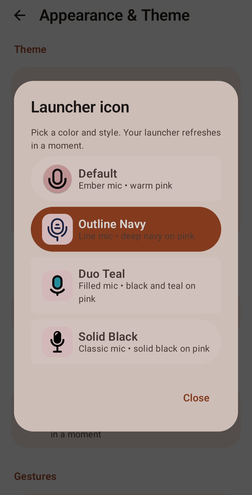
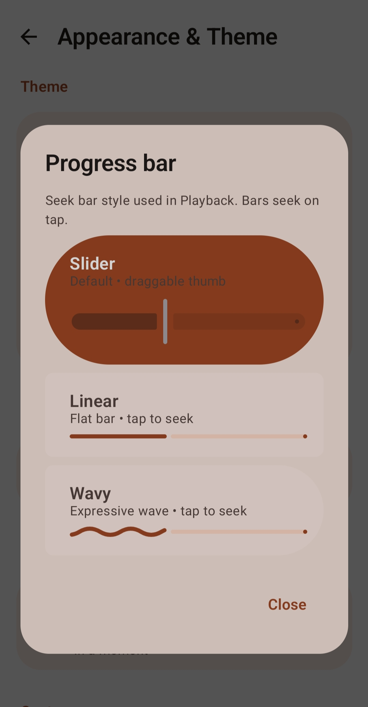
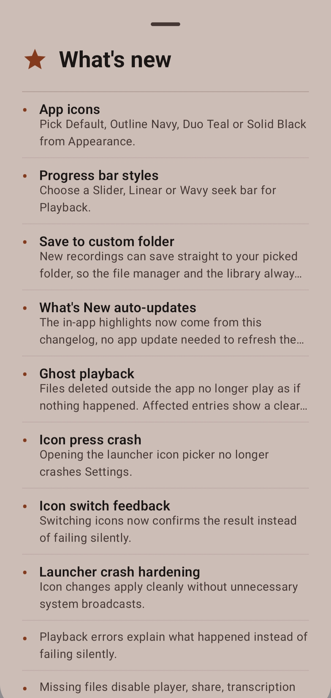

# Changelog

## [1.5.0] — Rhyolite

A reliability and personalization update. Recordings now live where you put them, missing files are handled gracefully, and the app is easier to make your own.

  
  
  

<em>Left: Launcher icon picker. Middle: Progress bar styles. Right: What's New sheet.</em>

### What's new

- **App icons** — Pick Default, Outline Navy, Duo Teal or Solid Black from Appearance.
- **Progress bar styles** — Choose a Slider, Linear or Wavy seek bar for Playback.
- **Expressive search** — The search bar is now a docked Material search with quick results. Tap a match to open it.
- **Save to custom folder** — New recordings can save straight to your picked folder, so the file manager and the library always match.
- **What's New auto-updates** — The in-app highlights now come from this changelog, no app update needed to refresh them.

### Fixes

- **Ghost playback** — Files deleted outside the app no longer play as if nothing happened. Affected entries show a clear File missing state instead.
- **Single launcher icon** — Switching icons now replaces the icon instead of adding a second app entry.
- **Icon press crash** — Opening the launcher icon picker no longer crashes Settings.
- **Icon switch feedback** — Switching icons now confirms the result instead of failing silently.
- **Launcher crash hardening** — Icon changes apply cleanly without unnecessary system broadcasts.
- **Single progress bar** — Cleaned playback no longer shows two stacked bars.

### Improvements

- Playback errors explain what happened instead of failing silently.
- Missing files disable player, share, transcription and enhancement with a clear banner.
- Transcription and enhancement work with files in picked folders.
- Smoother playback progress updates with fewer wasted redraws.
- What's New entries are short one-liners, capped at two lines.

---

### Updating from 1.4.0

Just update — no extra steps. If you use a custom folder, open Settings → Storage once and turn on Save to custom folder to keep a single copy going forward.

## [1.4.0] — Pumice (previous release)

Recording details card, swipe tip, inline card playback, storage fixes and automatic version display. See the release notes in the app for details.
